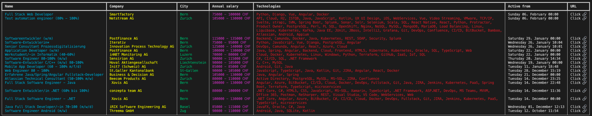

# A simple CLI for swissdevjobs.ch

*Disclaimer  
This tool is not complete and only serves the needs that I had.  
It has literally been written in 20 minutes.  
Currently, it filters the jobs based on their type (Part-time).*  

----


## Example output


----

## Example JSON of a job listing
The following properties could also be parsed and rendered by the tool:
```json
	"_id": "5db86fd387f2090017cc8548",
	"filterTags": ["3D" "VR", "Vue", "Web", "iOS", "Fullstack"],
	"technologies": ["Python", "Django", "Vue", "Angular", "Docker"],
	"logoImg": "smartfactory-logo.png",
	"cityCategory": "Bern",
	"longitude": 7.244933,
	"latitude": 47.133292,
	"activeFrom": "2022-02-06T00:00:00.000+01:00",
	"candidateContactWay": "CompanyWebsite",
	"redirectJobUrl": "https://jobs.smartfactory.ch/jobs/1137809-full-stack-web-developer-60-100",
	"name": "Full Stack Web Developer",
	"company": "Smartfactory",
	"address": "Hans-Hugi-Strasse 3",
	"postalCode": "2502",
	"personEmail": "sarah@smartfactory.ch",
	"companyType": "Services",
	"companySize": "<50",
	"language": "German",
	"hasVisaSponsorship": "No",
	"techCategory": "Python",
	"expLevel": "Senior",
	"jobType": "Part-Time",
	"salaryFrom": 5000,
	"salaryTo": 7000,
	"__v": 0,
	"jobUrl": "Smartfactory-Full-Stack-Web-Developer",
	"annualSalaryFrom": 75000,
	"annualSalaryTo": 100000,
	"actualCity": "Biel",
	"companyId": "5ccff5779eb5ce0017b976d6",
	"offerStockOrBonus": false,
	"perkKeys": ["weeksvacation5", "retreat", "beer", "coffee", "flexiblework", "remote2day", "parttime", "relaxroom", "standingdesk", "tablefoot", "teamevents"],
	"tier": "basic"
```

---

## PR's are welcome 🎁